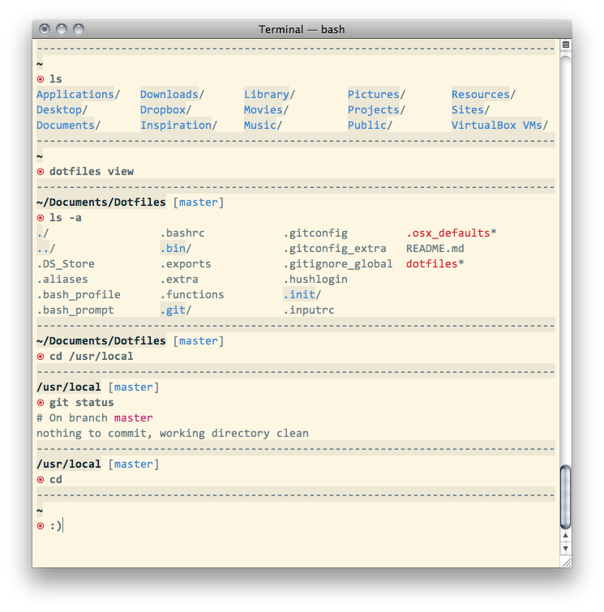

# Dotfiles by Ivan Nikolić

Home is where the dotfiles are. These are mine.

## Installation

1. Clone the repository in some directory (maybe `~/dotfiles`?):  
	
	```bash
	$ git clone https://github.com/niksy/dotfiles.git
	```

2. Enter directory where you’ve cloned dotfiles and run install script with `link` argument:  
	
	```bash
	$ sh dotfiles link
	``` 

	The script will symlink/copy all the necessary files to `~` directory. Follow instructions after the job is done.

3. To remove created symlinks and/or remove copied files, run same install script inside `dotfiles` directory but with `unlink` argument:

	```bash
	$ sh dotfiles unlink
	```

4. For your convenience there is a `dotfiles refresh` command which will source all the files (except `.osx`) if you’ve made some changes. That command is aliased to `dfr` for even more convenience :).

### Custom options

`~/.extra` and `.gitconfig_extra` can be used to add custom commands without the need to change core files or to add commands you don’t want to commit to a public repository. These files are also the ones which are not symlinked—instead, they are copied to your `~` directory.  

Example of `.extra` file:

```bash
# PATH additions
export PATH="~/bin:$PATH"

# Set the extra .gitconfig file used for personal settings (modifies ~/.gitconfig)
git config --global include.path "$HOME/.gitconfig_extra"

# Set computer name which can be used with .osx file
COMPUTER_NAME="{Le machine}"
```

### Terminal display

`.bash_prompt` and everything related to coloring of display is customized to work with [Solarized Light theme](https://github.com/altercation/solarized). You can find my current OS X terminal preferences inside `.init` directory. Typeface in the screenshot is [DejaVu Sans Mono](http://dejavu-fonts.org/).



### OS X defaults

These are some OS X defaults I use, but larger collection can be found in [`.osx` defaults by Mathias Bynens](https://github.com/mathiasbynens/dotfiles/blob/master/.osx) and in comments at the top of the file in my repository:

```bash
$ source ~/.osx_defaults
```

### Homebrew

Installing [Homebrew](http://mxcl.github.com/homebrew/) will save your sanity while trying to install packages not available by default on OS X.

I like to install Homebrew and its packges without any automation script, it makes it easier to debug if something goes wrong while installing packages :).

Here is the list of packges I currently use:

* [git](http://git-scm.com/)
* [meld](http://meldmerge.org/)
* [mysql](http://dev.mysql.com/doc/refman/5.5/en/)
* [tree](http://mama.indstate.edu/users/ice/tree/)
* [php](http://php.net/)
* [phpmyadmin](http://www.phpmyadmin.net/home_page/index.php)

You can find whole list of available packages (along with other repositories) on [Braumeister](http://braumeister.org/).

## Acknowledgements

Code was taken from many sources and used [dotfiles by Mathias Bynens](https://github.com/mathiasbynens/dotfiles) as starting point.

Other sources and inspiration include:

* [Paul Irish](https://github.com/paulirish/dotfiles)
* [Nicolas Gallagher](https://github.com/necolas/dotfiles)
* [Mislav Marohnić](https://github.com/mislav/dotfiles)
* [Ben Alman](https://github.com/cowboy/dotfiles)
* [Henrik Nyh](https://github.com/henrik/dotfiles)
* [Jan Moesen](https://github.com/janmoesen/tilde)
* These articles on how to create [better](http://lifehacker.com/5840450/add-a-handy-separator-between-commands-in-your-terminal-on-mac-os-x-and-linux) [bash](http://net.tutsplus.com/tutorials/other/how-to-customize-the-command-prompt/) [prompt](http://net.tutsplus.com/tutorials/tools-and-tips/how-to-customize-your-command-prompt/)
